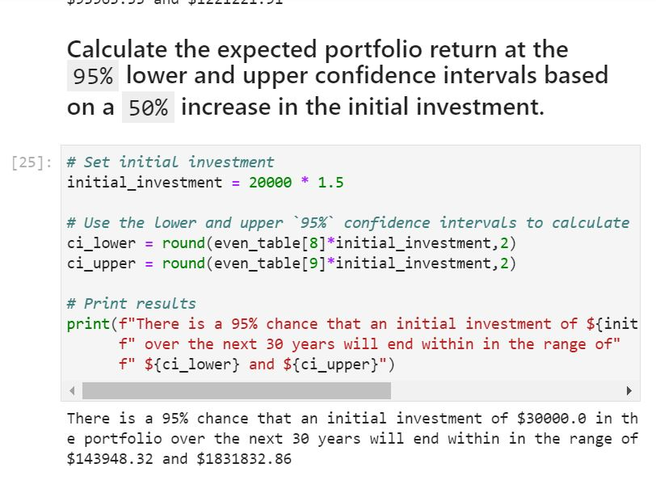

# FinancialPlanning
Bootcamp Project 

This project has two parts.  Part 1 utilizes API's to pull data for Ethereum, Bitcoin, a bond fund, and a stock fund.  It uses current price data to create a system to figure out if people have enough savings based on their monthly income, monthly expenses, and how much they have in savings.  Part 2 is a retirement planner that utilizes a Monte Carlo simulation to forecast retirement savings for an individual based on their initial investment.  This creates a system to give financial guidance to many individuals and rather than creating a system for each individual, it allows the financial planner to change time and date variables and run the two programs repeatedly. 

## Technologies

This project uses Python 3.8 and iPython in Jupyter Lab.  This also utilizes API's to "fetch" financial data. Windows is the operating system.

## Libraries Used:

    1. os - used to access operating system
    2. requests - used to pull API data
    3. pandas - used to to read data into dataframes
    4. load_dotenv - loads environment files
    5. alpaca_trade_api - used to get API files from Alpaca
    6. MCSimulution - used to run Monte Carlo simulation
    7. matplotlib - used to create graphs and plots
    
    
## Installation guide
This project requires the latest version of Anaconda.  

## Example

## Usage
To use this project, simply set your input parameters for how many days of data you want and how many simulations you want.  Then run the program.  If you want to run a new simulation with different time constraints, change the dates.

## Contributors
Ryan Dibeler

ryandibeler@gmail.com

## License
MIT License

Copyright (c) [2021] [Ryan Dibeler]

Permission is hereby granted, free of charge, to any person obtaining a copy
of this software and associated documentation files (the "Software"), to deal
in the Software without restriction, including without limitation the rights
to use, copy, modify, merge, publish, distribute, sublicense, and/or sell
copies of the Software, and to permit persons to whom the Software is
furnished to do so, subject to the following conditions:

The above copyright notice and this permission notice shall be included in all
copies or substantial portions of the Software.

THE SOFTWARE IS PROVIDED "AS IS", WITHOUT WARRANTY OF ANY KIND, EXPRESS OR
IMPLIED, INCLUDING BUT NOT LIMITED TO THE WARRANTIES OF MERCHANTABILITY,
FITNESS FOR A PARTICULAR PURPOSE AND NONINFRINGEMENT. IN NO EVENT SHALL THE
AUTHORS OR COPYRIGHT HOLDERS BE LIABLE FOR ANY CLAIM, DAMAGES OR OTHER
LIABILITY, WHETHER IN AN ACTION OF CONTRACT, TORT OR OTHERWISE, ARISING FROM,
OUT OF OR IN CONNECTION WITH THE SOFTWARE OR THE USE OR OTHER DEALINGS IN THE
SOFTWARE.

